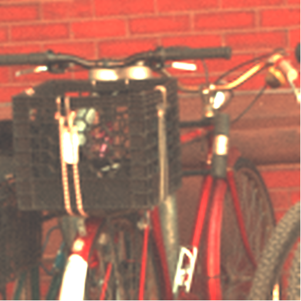

# Variational fusion of hyperspectral and multispectral images


## Docker

This project is coded with C++ and the libraries needed for its functionning are included in a Dockerfile which enables our code to work on any OS based systems

* First Docker needs to be installed on you system with the help of this link: https://docs.docker.com/engine/install/

* Clone our project in the location of your choosing on your local system and open a terminal in the cloned folder

## Building the docker container

From the Dockerfile we're going to build an image called "hsmsfusion" in the folder downloaded from our Github repository

```bash
docker build -t hsmsfusion .
```

## Fusion

At this point all the libraries and the packages are installed. The next commannd line does multiple manouvers: it starts a docker container named ```demofusion``` from the built image, it mounts a volume on the docker container that points to the ```demo``` folder in downloaded one and launches the ```demo.sh``` script. 

The ```demo.sh``` script executes three commands: it moves to the ```demo``` folder, it creates the HS and MS images and all the data needed for the fusion and finally, it carries out the fusion with the generated data. 

```bash
docker run --name demofusion -v $PWD/demo:/home/demo hsmsfusion sh demo.sh
```
## Using other dataset
In case you want to run the fusion with your own ```hyperspectral (hs)``` and ```multispectral (ms)``` data, the ```interpolated hs``` image, the ```panchromatic``` image and the ```interpolated panchromatic``` image should be generated. For this, you just have to, in the ```batch_hyperspectral_data.sh```, comment out the parts that generate the ```hs``` and ```ms``` images and rename the ```hs``` and ```ms``` images into: ```name.hyper.noisy.tif``` and ```name.multi.noisy.tif``` respectively where ```name``` is the name of the image before executing the ```demo.sh``` script.

## Recovering the fusion result
The fusion result will be available in the ```demo``` folder in the cloned repository.  

## Fusion example 
<html>
    <body>
    <figure>
    <p align="middle">
    
      &nbsp; &nbsp; &nbsp; &nbsp;
    
      &nbsp; &nbsp; &nbsp; &nbsp;
    
      &nbsp; &nbsp; &nbsp; &nbsp;
    <figcaption>Example of fusion on the image "Bicycles" from Harvard dataset. From left to right. Ground truth image, hyperspectral image and the fused image with the variational model.</figcaption>
    </p>
    </figure>
    </body>
</html>

## Citation
If you use our code please consider citing our work

```
@article{mifdal2021variational,
  title={Variational Fusion of Hyperspectral Data by Non-Local Filtering},
  author={Mifdal, Jamila and Coll, Bartomeu and Froment, Jacques and Duran, Joan},
  journal={Mathematics},
  volume={9},
  number={11},
  pages={1265},
  year={2021},
  publisher={Multidisciplinary Digital Publishing Institute}
}
```


